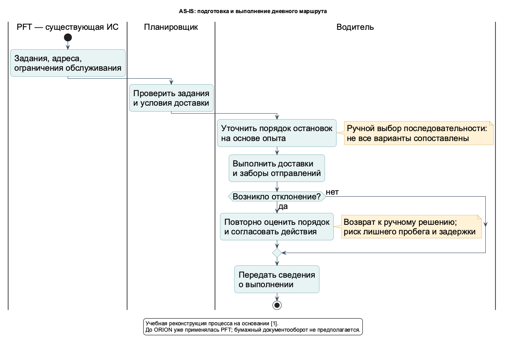
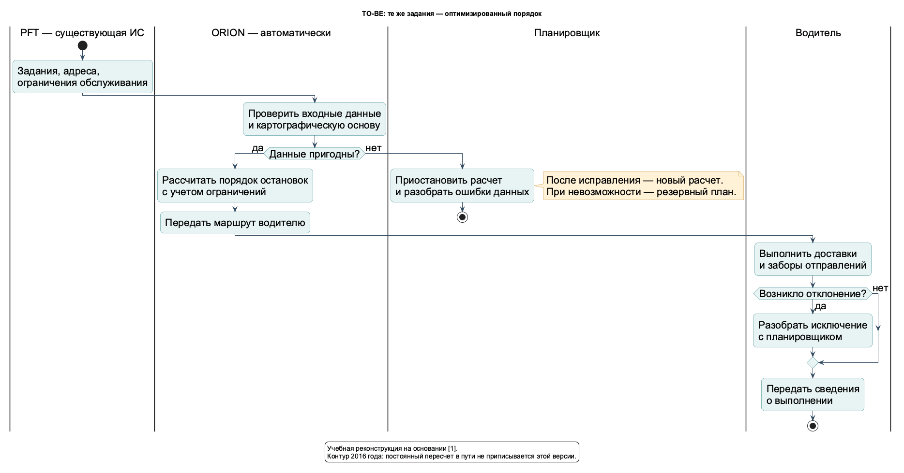
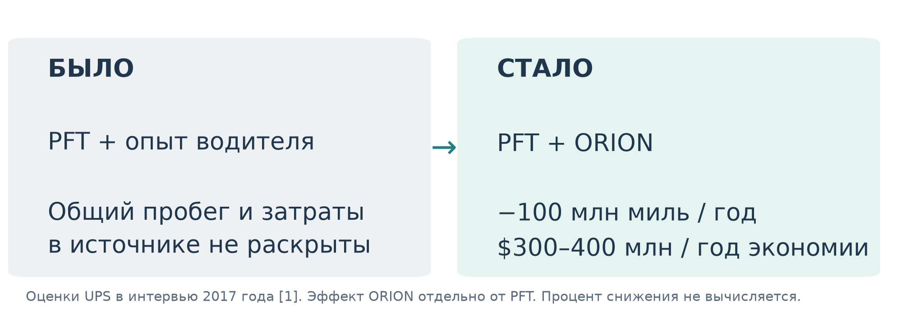

# Анализ кейса UPS ORION

## 1. Границы и доказательный статус
Исследуется первоначальное внедрение ORION (On-Road Integrated Optimization and Navigation) в процессе доставки UPS, завершённое в 2016 году.[1] Это не обзор всех ИС UPS и не описание современной версии продукта. В интервью 2017 года предложения водителю в течение дня и навигация перечисляются как дальнейшее развитие; они не включены в фактический TO-BE первоначального внедрения.[1]

**ФАКТ** — прямое сообщение источника. Это подтверждает опубликованное утверждение, но не заменяет независимый аудит. **ВЫВОД** — интерпретация нескольких подтверждённых сведений. **РЕКОНСТРУКЦИЯ** — авторская учебная модель, которую нельзя выдавать за внутренний документ UPS.

## 2. Предметная область
| Элемент | Описание | Статус |
|---|---|---|
| Компания / отрасль | UPS, доставка отправлений и логистика | ФАКТ [1] |
| Процесс | Подготовка и исполнение дневной последовательности доставок и заборов отправлений | ФАКТ о назначении, учебная граница [1] |
| До внедрения | Уже работала собственная платформа Package Flow Technologies — PFT | ФАКТ [1] |
| ИС | ORION — собственное оптимизационное решение поверх PFT | ФАКТ [1] |
| Разработчик | Команда исследования операций UPS, совместно с ИТ и владельцами процесса | ФАКТ [1] |
| Пользователи | Водитель, планировщик, руководитель доставки | РЕКОНСТРУКЦИЯ ролей на основании участия водителей, frontline и управления [1] |
| Заинтересованные стороны | Клиенты, руководство UPS, ИТ-сопровождение, водители, команда внедрения | ВЫВОД из требований сервиса и состава участников [1] |
| Ограничения | Требования обслуживания, точность карт, стабильность и применимость маршрута, принятие людьми | ФАКТ [1] |
| Вне границ | Межгород, сортировка, вся сетевая оптимизация и последующие версии | Авторское ограничение |

## 3. Реестр значимых фактов
| ID | Утверждение | Источник | Ограничение интерпретации |
|---|---|---|---|
| F01 | Жилая доставка менее плотная по расстоянию между остановками и количеству отправлений на остановку | [1], Q1 | Не означает, что весь поток UPS имел одинаковую плотность |
| F02 | Персонализация доставки усложняет обслуживание и увеличивает затраты | [1], Q1 | Не дан размер удорожания |
| F03 | PFT внедрена в 2003 году и создала основу для ORION | [1], Q2–Q3 | AS-IS нельзя изображать полностью ручным |
| F04 | Исследования ORION начались в 2003 году | [1], Q2 | Это не дата промышленного запуска |
| F05 | Первая модель испытана в поле в 2008 году, Gettysburg, Pennsylvania | [1], Q2 | Не установлены месяц и длительность испытаний |
| F06 | Первоначальное внедрение завершено в 2016 году | [1], Q2, биография | Границы релизов после 2016 не исследуются |
| F07 | ORION использует собственное ядро исследования операций UPS над PFT | [1], Q2–Q3 | Не подтверждены облако, микросервисы, конкретная СУБД |
| F08 | Рассматривает более 200000 способов пройти маршрут и выдаёт решение за секунды | [1], Q2 | Это характеристика из интервью, не гарантия SLA и не доказательство глобального оптимума |
| F09 | Покупные карты оказались недостаточно точными; проблема данных сначала воспринималась как ошибка алгоритма | [1], Q4–Q5 | Не названа доля ошибок |
| F10 | Потребовался баланс оптимальности и стабильности поведения водителя | [1], Q4 | Не указана точная целевая функция |
| F11 | Команда внедрения выросла до 700 человек, проведено 11 разных тестов в нескольких операциях | [1], Q4, Q7 | Это не 700 разработчиков и не 11 релизов |
| F12 | Площадки должны были удовлетворять входным и выходным критериям внедрения | [1], Q7 | Сами чек-листы полностью не опубликованы |
| F13 | ORION дает 100 млн миль сокращения годового пробега; экономия $300–400 млн/год — оценка UPS | [1], Q2, биография | Не независимый аудит, не накопленная экономия |
| F14 | Эффект PFT 85 млн миль/год отдельно от ORION | [1], Q2 | В работе не суммируется в эффект ORION |

## 4. AS-IS — реконструкция по фактам F01–F03 и F10
Дневные задания уже доступны в существующей ИС PFT. Планировщик проверяет условия обслуживания; водитель уточняет порядок остановок на основе опыта. Он выполняет доставки и заборы. При отклонениях возникает повторное ручное решение о последовательности и согласование действий. Сведения о выполнении возвращаются в операционный контур.

Это учебная последовательность, а не стенограмма реальной инструкции UPS. Нет доказательств обязательных бумажных листов, Excel, повторного ввода адресов или конкретного согласующего интерфейса — эти детали не добавлены. Дублирование в модели означает повторное принятие решения при отклонении, а не доказанный двойной ввод данных. Неизвестные длительности операций не заполнены произвольными цифрами.

Проблемные точки: ограниченность ручного сравнения вариантов; возможный лишний пробег; зависимость от опыта; ошибки исходных карт; риск нарушения сроков из-за неподходящего маршрута. Последние последствия — выводы о риске, а не опубликованные частоты нарушений. Часть проблемы точности карт стала особенно заметна при проектировании ORION, а не обязательно была отдельным инцидентом AS-IS.[1]

## 5. Преобразование процесса
| Проблема | Требование | Изменение TO-BE | Проверка результата |
|---|---|---|---|
| Человек не сопоставляет множество вариантов | Рассчитать допустимую последовательность | Оптимизационное ядро | Пробег при сопоставимых заданиях |
| Неточные карты | Проверка и исправление исходных данных | Контур качества данных | Доля непригодных заданий / ручных исправлений |
| «Математически хороший» маршрут непригоден водителю | Учитывать ограничения и стабильность | Проверка с участием водителей | Выполнимость и принятие маршрута |
| Масштабирование нового поведения | Обучение и критерии готовности | Внедрение по площадкам | Готовность данных и персонала |
| Автоматизация может скрыть исключение | Не публиковать непроверенное решение | Остановка расчета и ручной разбор | Отсутствие молчаливой потери задания |

Содержание требований и проверочных метрик — РЕКОНСТРУКЦИЯ. Основания — F07–F12. В таблице нет обещаний о достигнутых KPI, кроме отдельно опубликованных эффектов.

## 6. TO-BE — реконструкция по F07–F12
Входные задания остаются теми же. Система проверяет их пригодность вместе с картографической основой; при ошибках человек исправляет данные и инициирует новый расчет либо выбирает резервный план. Для пригодных данных ORION рассчитывает порядок остановок с учетом ограничений и передает его водителю. Водитель выполняет маршрут, вместе с планировщиком обрабатывает исключения и передает сведения о выполнении.

Автоматизировано **планирование последовательности**, а не физическая доставка. Оператор не обязан вручную пересматривать каждое решение. У человека остаются ответственность за нестандартные условия и безопасное выполнение. Автоматическое непрерывное перепланирование в пути не включено в историческую версию.

## 7. Архитектурный вывод
Подтверждены существующая PFT, собственный алгоритмический контур UPS и критическая зависимость от карт.[1] Для учебной модели это удобно описывать логической многослойной клиент-серверной архитектурой. Разделение клиента, прикладного расчета и данных является **реконструкцией**, а не опубликованной физической схемой. Из наличия слоёв не следует микросервисность. Из связи систем не следует облачное размещение. Подробности — [architecture.md](../docs/architecture.md).

## 8. Жизненный цикл и календарь
Подтвержденные вехи: 2003 — исследования; 2008 — первый полевой тест; 2016 — завершение внедрения.[1] Первичный пресс-релиз UPS добавляет период прототипирования 2008–2011 и официальный запуск в 2013 году.[5] Основной `gantt.png` показывает этот период и вехи с точностью до года. Положение маркера внутри года условно, а промежутки между событиями не выдаются за датированные стадии. Детальная сетка с месяцами и зависимостями не опубликована. Отдельный `gantt_estimate.png` даёт оценочный график **одной учебной площадки**, относительные недели 1–17; это не длительность всей программы UPS.

Профессиональная публикация сообщает, что в декабре 2015 ORION использовали 35000 водителей и что они получали утром оптимизированный порядок заранее назначенных отправлений.[4] Это дополнительно обосновывает границу учебного процесса и отделение последовательности от распределения всей сети.

Наиболее подходящая модель ЖЦ: итерации исследования и проектирования с инкрементальным внедрением по площадкам и критериями готовности. Факт использования Scrum не установлен.

## 9. Бизнес-результаты и ограничения измерения
Опубликованы сокращение годового пробега на 100 млн миль и оценка UPS экономии $300–400 млн в год от ORION.[1] Исходные абсолютные пробег и расходы не даны, поэтому диаграмма «Было / Стало» показывает изменение, а не вымышленные базовые столбцы. Не вычисляются процент снижения, срок окупаемости, ROI или экономия на одного водителя: для этого недостает сопоставимых исходных данных. Экономию PFT не следует прибавлять к эффекту ORION и называть результатом внедрения ORION.

## 10. Что не установлено
Точная физическая архитектура, СУБД, языки программирования исторической версии, протоколы, модели авторизации, фактические RTO/RPO, календарные границы каждой стадии, внутренние спецификации и формальные роли интерфейса не установлены. Учебные предложения по ним не маркируются как факты. Дальнейшая ML-функция — собственный вариант развития, а не утверждение, что UPS сегодня такой функции не имеет.

Источники: [sources.md](sources.md); документируемые артефакты и легенда — [README](../README.md).

## Sources

[1] https://www.odbms.org/blog/2017/08/big-data-at-ups-interview-with-jack-levis — Big Data at UPS. Interview with Jack Levis.
[4] https://web.archive.org/web/20250516154643/https://pubsonline.informs.org/do/10.1287/orms.2016.03.10/full
[5] https://www.globenewswire.com/news-release/2016/04/12/828097/30428/en/UPS-Wins-2016-INFORMS-Franz-Edelman-Award-for-Changing-the-Future-of-Package-Delivery.html
