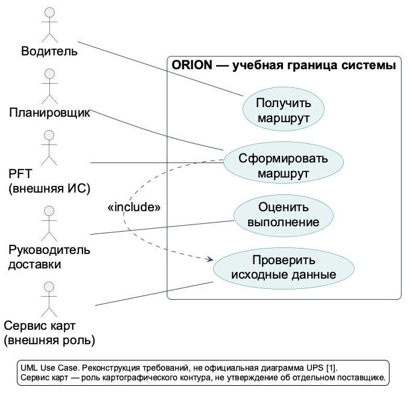
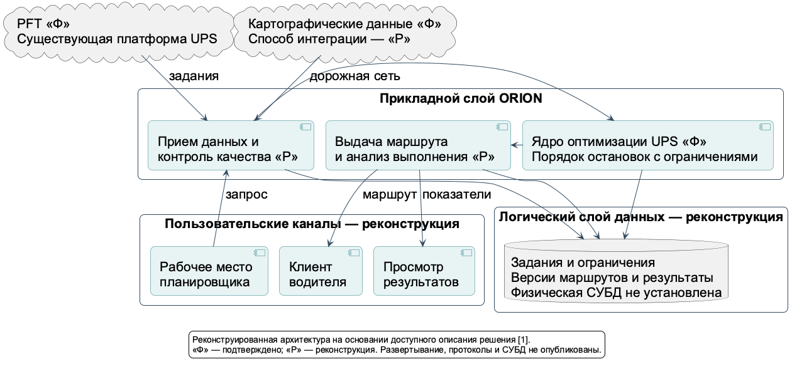
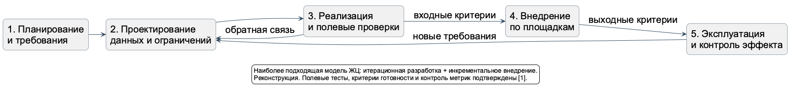
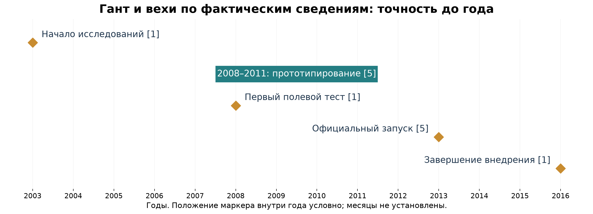

# Практическая работа № 1. Проектирование информационных систем

## 1. Тема работы

Анализ внедрения информационной системы оптимизации маршрутов **UPS ORION**: от исходного процесса к требованиям, архитектуре, жизненному циклу и бизнес-эффекту.

РТУ МИРЭА. Дисциплина «Проектирование информационных систем». Практическая / самостоятельная работа № 1. Выполнил: Ваздаев Даниил Ильич, УИБО-09-23.

В работе применяются метки **ФАКТ**, **ВЫВОД**, **РЕКОНСТРУКЦИЯ**. Подтвержденная публикация корпоративной оценки не означает независимый аудит. Укрупненные схемы на слайдах и подробные диаграммы проекта описывают одну учебную модель.

## 2. Цель

Исследовать реально внедренную ИС на уровне изменения бизнес-процесса; установить автоматизируемое решение; сформировать сопоставимые AS-IS и TO-BE, UML-варианты использования и спецификацию; обосновать логическую архитектуру и подходящий жизненный цикл. Отдельная задача — показать границу проверенного знания и учебных проектных предположений.

Метод: сравнение трех реальных кандидатов; чтение первичных и профессиональных источников; реестр фактов; реконструкция моделей; проверка согласованности диаграмм, отчетных показателей и презентации. Итог защиты — 15 слайдов и текст выступления примерно на 14 минут.

## 3. Выбранный бизнес-кейс

Сравнивались UPS ORION, миграция корпоративных ИС Carlsberg на Azure и Smart tasking DHL. Полное сопоставление сохранено в [research/case_selection.md](research/case_selection.md). Для дальнейшего анализа выбран только ORION: доступны ясное операционное решение, сведения о собственной PFT и разработчике, проблемы данных, полевые испытания и оценка бизнес-эффекта.[1]

**ФАКТ.** Первоначальное внедрение ORION завершилось в 2016 году.[1] **РЕКОНСТРУКЦИЯ границы.** Рассматривается дневной маршрут одного водителя: от доступных заданий до выполнения и получения операционных результатов. Распределение всей сети, межгород, сортировка и поздние динамические версии исключены. Это устраняет смешение проектов разных поколений.

## 4. Описание предметной области

**Компания:** UPS. **Отрасль:** логистика и доставка отправлений. **Система:** ORION — собственное оптимизационное решение UPS поверх собственной Package Flow Technologies, PFT.[1] **Разработчик:** команда исследования операций UPS; в успехе проекта объединены ИТ и проектирование процессов.[1]

**Пользователи модели:** планировщик, водитель, руководитель доставки. **Заинтересованные стороны:** клиенты, владелец процесса, ИТ и владельцы данных, команда внедрения. Эти роли — учебная классификация участников, а не копия реального перечня прав доступа.

**Ограничения:** требования обслуживания клиентов, точность карт, необходимость сочетать оптимальность со стабильностью маршрута и принятие рекомендаций сотрудниками.[1] Не установлены официальные SLA, СУБД, физическая топология или точные часы работы. Их отсутствие не восполняется вымышленными значениями.

## 5. Проблема

**ФАКТ.** Жилые доставки менее плотны, а персонализация усложняет и удорожает обслуживание.[1] **ВЫВОД.** При заданном наборе клиентов необходимо выбирать последовательность, сокращающую пробег без ухудшения обслуживания. Наличие ИС с заданиями еще не означает оптимальность такого выбора.

**ФАКТ.** Покупные карты оказались недостаточно точными; первоначально дефекты входов ошибочно искали в алгоритме. Потребовались работа с правилами и водителями, а крупнейшим вызовом стало управление изменениями.[1] Профессиональная публикация также описывает ранние неудачные полевые попытки и важность участия водителей.[4]

Прослеживаемость: ручной выбор → расчет с ограничениями → проверка пробега; недостаточная точность карт → контроль входов → проверка пригодности; непринятие нового порядка → полевые тесты и обучение → проверка выполнимости. Эти требования и приемочные метрики являются реконструкцией.

## 6. AS-IS

**РЕКОНСТРУКЦИЯ процесса до ORION.** PFT предоставляет задания и условия; планировщик проверяет их; водитель уточняет порядок по опыту; выполняет доставки и заборы; при отклонении повторно оценивает порядок и согласовывает действия; сведения о выполнении возвращаются в операционный контур. PFT уже существовала: это не полностью ручной или бумажный процесс.[1]

Ручные операции — выбор/уточнение последовательности и согласование исключений. Источники данных — задания, адреса, ограничения PFT. Узкое место — ограниченность сравнения вариантов человеком. Возможные последствия — лишний пробег и задержка; их частоты не опубликованы. Повторная оценка порядка является учебной моделью дублирования решения, а не доказанным повторным вводом адресов.

*Рисунок 1. AS-IS, PlantUML Activity Diagram; учебная реконструкция, не BPMN.*

Подробная трассировка фактов и рисков: [case_analysis.md](research/case_analysis.md).

## 7. TO-BE

**ФАКТ.** ORION выдает водителю оптимизированную последовательность для заранее назначенных отправлений; профессиональная статья описывает получение такого порядка каждое утро.[4] Собственный оптимизационный контур над PFT и зависимость от точности карт подтверждены интервью.[1]

**РЕКОНСТРУКЦИЯ процесса.** Сохраняются те же входы и границы. Система проверяет пригодность данных, рассчитывает порядок с ограничениями и передает маршрут водителю. Непригодные данные приводят к остановке расчета и ручному разбору. После исправления инициируется новый расчет; при невозможности действует согласованный резервный порядок. Водитель выполняет доставку и с человеком разбирает исключения. Сведения о выполнении закрывают цикл.

*Рисунок 2. TO-BE, PlantUML Activity Diagram; учебная реконструкция.*

Автоматизировано сравнение последовательностей, но не физическая доставка. Непрерывная динамическая перестройка в пути не приписывается первоначальной версии: в интервью 2017 года это дальнейшее развитие.[1]

## 8. UML Use Case

*Рисунок 3. UML Use Case; учебная граница ORION.*

### 1. Статус и граница модели

Спецификация является учебной реконструкцией для первоначальной ORION, внедрение которой завершилось в 2016 году.[1] Интервью подтверждает работу ORION поверх PFT и предоставление оптимизированного маршрута водителю, но не публикует реальные экраны, команды пользователя и последовательность внутренних вызовов.[1] Ниже описывается предлагаемое поведение системы, а не восстановленная инструкция UPS.

Граница моделирования — **ORION**. Первичные акторы общей модели: Планировщик, Водитель, Руководитель доставки. Вторичные: система PFT и Сервис карт. Последний обозначает логическую роль существующего картографического контура; его внешний поставщик или отдельное техническое развертывание не доказаны. Акторы находятся вне выбранной границы, даже если организационно относятся к UPS.

### 2. Паспорт сценария

- **Идентификатор:** UC-01.
- **Название:** Сформировать маршрут.
- **Краткое описание:** ORION получает заданный набор остановок и ограничения, проверяет пригодность данных, рассчитывает и сохраняет допустимую последовательность для последующего получения водителем.
- **Тип:** основной пользовательский вариант использования, уровень цели пользователя; учебная спецификация поведения системы («чёрный ящик»).
- **Цель:** получить пригодную к выполнению последовательность обслуживания заданий с учетом ограничений.
- **Основной актор:** Планировщик.
- **Поддерживающие акторы:** система PFT, Сервис карт.
- **Триггер:** Планировщик запрашивает формирование маршрута для выбранного набора заданий.
- **Предусловия:** пользователь уполномочен планировать доставку; набор заданий определен; действующие ограничения доступны; источники данных доступны для получения либо имеется разрешенная актуальная версия.
- **Успешное постусловие:** маршрут сохранен с идентифицируемыми входными данными и готов к последующему получению водителем.
- **Минимальная гарантия:** задания не теряются; неуспешный расчет не выдается за готовый маршрут; причина остановки доступна Планировщику.

### 3. Основной успешный сценарий

1. Планировщик определяет набор доставки и запускает формирование. Система фиксирует контекст запроса без предположений о конкретном пользовательском интерфейсе.
2. ORION получает от PFT сведения о заданиях и ограничениях, а от Сервиса карт — необходимые характеристики точек и сети.
3. ORION выполняет включаемый вариант использования **«Проверить исходные данные»**: проверяет полноту, согласованность и пригодность входного набора.
4. Для прошедшего проверку набора оптимизационное ядро рассчитывает порядок посещений с учетом ограничений обслуживания и принятого баланса стабильности и оптимальности.
5. Система предъявляет Планировщику результат и обнаруженные предупреждения. Планировщик разбирает вопросы, требующие человеческого решения; этот шаг является проектным допущением.
6. После разрешения исключений система сохраняет принятую версию маршрута и делает ее доступной для отдельного сценария «Получить маршрут».

### 4. Альтернативные потоки и исключения

**А1 — некорректные данные, шаг 3.** Система указывает проблемные задания и причину. Планировщик организует исправление в ответственном контуре; после обновления выполняется повторная проверка. Незаметное удаление задания запрещено проектным требованием.

**А2 — недоступен источник, шаг 2.** Формирование приостанавливается. Использование ранее полученных данных допускается только по заранее согласованной политике актуальности; иначе запрос завершается диагностируемой ошибкой.

**А3 — допустимый маршрут не найден, шаг 4.** Система сообщает о невозможности завершить расчет. Планировщик пересматривает распределение заданий или передает вопрос руководителю; обязательства обслуживания нельзя автоматически ослаблять ради успешного статуса.

**А4 — результат требует изменения, шаг 5.** Планировщик уточняет разрешенные параметры с фиксацией причины. Сценарий возвращается к проверке данных, затем выполняется новый расчет. Несогласованная версия не публикуется.

### 5. Связи и приемка

В общей модели «Сформировать маршрут» связан отношением **include** с «Проверить исходные данные»: проверка обязательна для основного сценария. «Получить маршрут» связан с Водителем, а «Оценить выполнение» — с Руководителем доставки. Они самостоятельны: последующее использование результата не означает обязательного UML include. Отношения extend и generalization не добавляются без содержательной необходимости.

Приемочные проверки охватывают корректный набор, ошибку координат, недоступность PFT, противоречивые ограничения и повторный расчет. Для каждого случая проверяются сохранность заданий, понятный статус и отсутствие публикации непригодного результата. Целевое время ответа устанавливается отдельным испытанием; сообщение UPS об анализе более 200 000 вариантов за секунды не заменяет критерий производительности учебной реализации.[1]

## 9. Архитектура ИС

*Рисунок 4. Реконструированная архитектура на основании доступного описания решения.*

### 1. Границы и достоверность модели

Рассматривается первоначальная ORION, внедрение которой завершилось в 2016 году, а не последующая динамическая версия.[1] Источник описывает собственную инфраструктуру Package Flow Technologies (PFT), оптимизационное ядро UPS и предоставление результата водителю.[1] Приведенная ниже многослойная клиент-серверная архитектура является **учебной логической реконструкцией** этих взаимодействий. Она не устанавливает фактическое размещение программ, технологический стек или организацию исходного кода UPS. Сведения о конкретной СУБД, облаке, протоколах и микросервисах отсутствуют; приписывать их компании нельзя.

Назначение системы — формировать выполнимую последовательность посещения клиентов с учетом требований обслуживания и сокращения затрат. В интервью сообщается, что ORION анализирует более 200 000 вариантов выполнения маршрута за секунды.[1] Это характеристика, сообщенная представителем UPS, а не результат нашего нагрузочного теста и не доказательство перебора всех математически возможных перестановок.

### 2. Исходный и целевой процессы

**AS-IS — реконструкция процесса до ORION, но уже с PFT.** PFT развивалась с конца 1990-х годов и была внедрена в 2003 году; она включала модели, виртуальную сеть, инструменты планирования и исполнения.[1] Поэтому исходное состояние нельзя изображать как исключительно бумажную работу. В учебной модели PFT предоставляет задания; планировщик проверяет состав доставки; водитель выбирает или уточняет порядок посещений, опираясь на опыт; затем выполняет доставку, вручную реагирует на отклонения и передает сведения для отчета. Детальная последовательность этих операций в интервью не опубликована.

**TO-BE — реконструкция процесса после внедрения первоначальной ORION.** Сохраняются задания, планировщик, водитель и контроль исполнения. Добавляется проверка пригодности данных для оптимизации, расчет порядка посещений с ограничениями и разбор исключений человеком. Водитель получает подготовленный маршрут и выполняет доставку. Смысл изменения заключается не в устранении человека, а в переносе трудоемкого выбора последовательности в оптимизационное ядро. Пересчет предложений в течение дня и навигация в интервью 2017 года названы будущими возможностями и не включаются в реализованный контур 2016 года.[1]

### 3. Логические слои и ответственность

**Слой взаимодействия с пользователями.** Планировщик инициирует формирование маршрута и рассматривает ошибки. Водитель получает согласованный результат. Руководитель доставки оценивает выполнение. Это роли учебной модели, а не подтвержденные названия экранов или должностей в конкретном интерфейсе UPS. Разделение прав предлагается по рабочим обязанностям: водитель не меняет общие правила оптимизации, а руководитель не обязан исправлять исходные адреса.

**Прикладной слой.** Координирует сценарий формирования: принимает запрос, получает исходный набор, запускает проверки, передает допустимые данные ядру и фиксирует результат. Здесь предлагается отделить успешный расчет от публикации маршрута. Такое разделение позволяет остановить выдачу при неразобранном исключении и сохраняет ответственность планировщика за спорное решение. Состояния заявки и правила подтверждения являются проектными предложениями.

**Слой оптимизации.** Представляет собственное ядро исследования операций UPS, созданное поверх PFT.[1] В реконструкции получает задания, ограничения обслуживания и характеристики сети, а возвращает порядок посещения и расчетные показатели. Баланс стабильности маршрутов и оптимальности был существенной проблемой реального проекта.[1] Поэтому цель нельзя сводить к кратчайшему расстоянию без учета выполнимости и привычной организации работы.

**Информационный и интеграционный слой.** Связывает ORION с PFT и картографическим контуром. Для учебной модели выделяются задания доставки, точки обслуживания, участки дорожной сети, ограничения, версии расчетов и результаты исполнения. Это логические сущности, не восстановленная схема базы данных. PFT остается внешней системой относительно выбранной границы ORION; «Сервис карт» обозначает логическую роль существующего картографического контура, а не доказанного внешнего поставщика.

### 4. Потоки данных и контроль качества

Основной поток идет от заданий PFT и картографических данных к проверке, затем к расчету, разбору исключений и выдаче маршрута. Обратный поток в проектной модели содержит сведения об исполнении для оценки руководителем. Интервью подтверждает постоянную оценку показателей, но не раскрывает конкретный формат обмена.[1]

Проверки рекомендуется выполнять до запуска оптимизатора: полнота задания, согласованность идентификаторов, корректность местоположения и отсутствие противоречащих ограничений. Основание для такого решения — реальный случай, когда недостаточное качество карт первоначально ошибочно приняли за дефект алгоритма.[1] Проблемное задание не должно молча исчезать из результата. Оно получает диагностируемое исключение, ответственное лицо и повторную проверку после исправления.

### 5. Надежность и проверяемость решения

В качестве учебных требований предлагаются журналирование изменений, сохранение версии входных данных и привязка маршрута к версии правил. Это необходимо для объяснения различий между расчетами. При недоступности данных либо невозможности построить допустимый маршрут система должна сообщить причину и передать решение планировщику, а не публиковать внешне успешный результат. Конкретный резервный порядок работы определяется площадкой заранее.

Приемка архитектуры проверяет сквозной сценарий, отсутствие потери заданий, разграничение ролей и воспроизводимость расчета на фиксированных входах. Производительность оценивается на согласованной нагрузке площадки, без подмены испытаний цифрами из интервью. Итоговая модель сохраняет подтвержденную связку PFT, собственного оптимизационного ядра и пользователя, но явно отделяет ее от предложенных механизмов реализации.

## 10. Жизненный цикл

**ФАКТ.** Исследования начались в 2003 году; первый полевой тест состоялся в 2008; завершение внедрения сообщено для 2016 года.[1] UPS дополнительно указывает прототипирование 2008–2011 и официальный запуск 2013.[5]

Следующие задачи, роли и артефакты — **проектная реконструкция**, а не внутренний регламент UPS. Возврат к предыдущей стадии допускается, если критерии выхода не выполнены.

#### Стадия 1. Обследование и требования

Задачи: описать процесс с существующей PFT, определить ограничения доставки, собрать проблемы планировщиков и водителей, зафиксировать исходные показатели. Артефакты: описание AS-IS, границы ORION, реестр требований, словарь показателей и список рисков. Роли: бизнес-аналитик, руководитель доставки, представители водителей, владелец PFT. Выход: согласованы границы пилота, ответственность за данные и критерии успешного обслуживания; исходное состояние пригодно для последующего сравнения.

#### Стадия 2. Подготовка данных и проектирование

Задачи: проверить адреса и дорожную сеть, выявить противоречивые ограничения, определить взаимодействия PFT и ядра. Артефакты: логическая архитектура, каталог проверок, набор контрольных маршрутов, журнал дефектов данных. Роли: архитектор, специалисты данных и карт, исследователь операций, планировщик. Выход: критические дефекты устранены либо имеют согласованное безопасное исключение; входной набор позволяет интерпретировать результат расчета. Ошибки данных рассматриваются отдельно от ошибок алгоритма.

#### Стадия 3. Итерационная разработка и испытания

Задачи: уточнять оптимизационную модель, проверять выполнимость маршрута, исследовать компромисс стабильности и сокращения затрат, повторять тесты после изменения правил. Артефакты: версия модели, протоколы испытаний, перечень ограничений, реестр изменений. Роли: исследователи операций, разработчики, тестировщики и операционные эксперты. Выход: система проходит согласованные функциональные и нагрузочные проверки; ограничения решения объяснены пользователям. В интервью упоминаются 11 различных тестов в нескольких операционных подразделениях, но их содержание не раскрыто.[1]

#### Стадия 4. Пилот и инкрементальное внедрение

Задачи: обучить пользователей, проверить готовность площадки, выполнить контролируемый запуск, собрать обратную связь и решить вопрос расширения. Артефакты: лист готовности, материалы обучения, отчет пилота, решение о переходе. Роли: команда внедрения, руководитель площадки, наставники водителей и поддержка. Выход: достигнуты входные и выходные критерии, назначены ответственные за исключения. В реальном проекте применялись критерии готовности площадок; команда внедрения выросла до 700 человек, а управление изменениями стало крупнейшим вызовом.[1]

#### Стадия 5. Эксплуатация и улучшение

Задачи: оценивать выполнение, разбирать отклонения, контролировать актуальность данных и планировать исправления. Артефакты: отчеты показателей, журнал инцидентов, перечень улучшений и протокол эксплуатационной приемки. Роли: руководитель доставки, поддержка, владельцы данных и команда развития. Выход: решение передано в устойчивое сопровождение; установлены основания возврата к обследованию или новой итерации. Постоянная оценка метрик соответствует описанию внедрения в интервью.[1]

## 11. Модель ЖЦ

**Наиболее подходящая модель ЖЦ для данного проекта:** гибрид итерационной разработки и инкрементального внедрения с критериями готовности. Это проектный вывод, не документированное название методологии UPS.

| Подход | Возможность применения и ограничение для кейса |
|---|---|
| Waterfall | Удобен для фиксации требований и формальной приемки, но жесткая однократная последовательность плохо учитывает пересмотр данных и бизнес-правил после полевых испытаний. |
| Iterative | Позволяет улучшать одну модель по результатам экспериментов. Подходит разработке ядра, но сам по себе не задает порядок массового развертывания. |
| Incremental | Позволяет расширять охват по готовым площадкам и ограничивать последствия ошибок. Требует общей основы данных и сопоставимых критериев приемки. |
| Spiral | Полезен акцентом на рисках: неверные карты, неприемлемое поведение маршрута, сопротивление пользователей. Полная формализация спирали может быть избыточной для отдельной площадки. |
| Agile | Поддерживает обратную связь и адаптацию требований. Это семейство ценностей и принципов, а не достаточное описание всех стадий и контрольных процедур проекта. |
| Scrum | Может организовать работу команды разработки короткими циклами. Не заменяет самостоятельно управление внедрением, обучение и готовность производственных операций. Применение UPS не подтверждено. |
| Гибрид | Соединяет обучение на итерациях с управляемым расширением охвата. Требует явного разделения исследовательских результатов и обязательных условий промышленного запуска. |

У гибрида есть цена: необходимо поддерживать единые критерии между площадками и не превращать исключения пилота в бессистемные локальные настройки. Поэтому предлагается сохранять причины изменений, проверять повторное использование решений и назначить владельца общих бизнес-правил.

*Рисунок 5. Предлагаемая модель ЖЦ и обратная связь.*

## 12. График проекта

Проверка источников дала период прототипирования и несколько временных вех. Поэтому основной график построен **по фактическим годам**, без выдуманных календарных дней: 2003 — начало исследований; 2008 — первый полевой тест; 2008–2011 — прототипирование; 2013 — официальный запуск; 2016 — завершение.[1][5]

*Рисунок 6. Исторический Гант и вехи с годовой точностью.*

Полоса обозначает только опубликованные годы прототипирования, а ромбы — события. Положение ромба внутри года условно и не обозначает месяц. Промежутки между вехами не заполняются ложными названиями и длительностями стадий. В апреле 2016 завершение являлось прогнозом [5]; после внедрения оно сообщено в интервью [1].

Дополнительно сохранены `gantt_estimate.csv` и `gantt_estimate.png`: **«Учебная реконструкция графика проекта. Точные сроки в открытых источниках не опубликованы»**. Это оценка одной площадки, не всей программы UPS: анализ недели 1–3, проектирование 3–6, настройка 6–10, пилот 10–13, обучение 13–15, стабилизация 15–17. Параллельность не требует одинаковых исполнителей; трудоемкость ресурсов не заявлена.

## 13. Результаты внедрения

**ФАКТ опубликованного сообщения.** В интервью 2017 года приводится сокращение пробега ORION на 100 млн миль в год и оценка UPS $300–400 млн годовой экономии.[1] Пресс-релиз 2016 использует формулировку «экономия и предотвращенные затраты», причем на тот момент это прогноз полного развертывания.[5] Значения не следует трактовать как прирост чистой прибыли или независимо аудированное измерение.

*Рисунок 7. Было / Стало: показаны изменения, а не выдуманные базовые значения.*

Базовые абсолютные расходы и пробег, сопоставимые для расчета процентов, не опубликованы в использованном интервью. Поэтому не рассчитываются процент сокращения, ROI и окупаемость. Эффект PFT не суммируется с эффектом ORION. Качественный вывод: лучшая последовательность снижает операционные издержки при сохранении задачи обслуживания; причинность и переносимость на другой бизнес требуют собственной проверки.

## 14. Сквозная цифровая технология

### 1. Проблема и статус предложения

Предлагается дополнить учебную модель ORION модулем машинного обучения, который прогнозирует **длительность обслуживания остановки вместе с неопределенностью прогноза**. Это авторское развитие рассматриваемой архитектуры, а не установленная функция UPS в 2016 году. Новизна для самой UPS не заявляется: интервью не дает полного перечня используемых моделей и уже описывает наличие предиктивных моделей в PFT.[1]

Рабочая гипотеза состоит в том, что одинаковые нормативы остановок могут недостаточно учитывать различия условий обслуживания. Даже короткий по расстоянию маршрут способен оказаться неудобным при систематической недооценке времени на отдельных точках. Предлагаемый модуль должен улучшать исходные оценки для оптимизатора, а не заменять исследование операций нейросетью. Проверка гипотезы требует реальных данных; наличие проблемы и размер эффекта нельзя считать доказанными заранее.

### 2. Данные и метод

Для пилота предлагаются минимально необходимые признаки: обезличенная категория точки, число отправлений, тип обслуживания, временной интервал, агрегированная история длительности и доступные характеристики подъезда. Состав признаков согласуется с владельцем процесса после проверки правомерности использования. Имена получателей, тексты обращений и персональные профили водителей не нужны для исходного эксперимента. Идентификаторы следует заменять техническими ключами, доступ ограничивать, сроки хранения устанавливать до сбора.

Целевая величина — время обслуживания остановки, определенное единообразно. Необходимо отделить его от движения между точками и уточнить правила учета ожидания. Пропуски отметок и аномальные значения сначала исследуются, а не автоматически удаляются: необычная длительность может отражать реальное сложное обслуживание. Для новых точек нужен резервный норматив, поскольку отсутствие истории не означает нулевую длительность.

В качестве проектного варианта можно сравнить простую агрегированную оценку с моделью квантильной регрессии. На выходе оптимизатор получает центральную оценку и интервал либо набор квантилей. Проверяется не только ошибка времени, но и калибровка неопределенности: насколько часто фактические значения попадают в заявленные интервалы. Сложная модель принимается лишь при подтвержденном преимуществе над понятной базовой оценкой.

### 3. Встраивание и человеческий контроль

Модуль располагается логически между подготовкой данных и оптимизационным ядром. Проверка исходных данных сохраняется обязательной. Оценки длительности передаются вместе с версией модели, признаком достаточности данных и уровнем неопределенности. Оптимизатор использует их как параметры планирования и может учитывать резерв времени, но конкретные правила резерва требуют согласования с операционными специалистами.

Планировщик рассматривает случаи высокой неопределенности и может выбрать нормативную оценку, зафиксировав причину. При отказе модели или обнаружении смещения процесс возвращается к утвержденным базовым параметрам. Автоматическое ухудшение условий обслуживания и оценивание дисциплины отдельного водителя не являются целями предложения. Водитель должен иметь возможность сообщить о неверной оценке условий точки через согласованный процесс обратной связи.

Предложение не сводится к динамической перестройке маршрута. Расчет может выполняться до начала доставки. В интервью 2017 года предложения в течение дня и навигация названы будущим развитием ORION; они не приписываются первоначальной версии, завершенной в 2016 году.[1]

### 4. Пилот, риски и критерии решения

Сначала проводится аудит определения длительности и качества записей. Затем выполняется ретроспективная проверка с временным разделением обучающего и контрольного периодов, чтобы сведения из будущего не попадали в обучение. Следующий этап — теневой расчет без изменения выдаваемых маршрутов. Только после проверки ошибок и обсуждения с пользователями допустим ограниченный управляемый пилот.

Оцениваются ошибка прогноза, калибровка интервалов, выполнимость расписания, соблюдение обязательств, затраты и нагрузка Планировщика на разбор исключений. Сравниваемые группы должны учитывать различия районов, состава доставки и периода наблюдения. Основные риски — смещение данных, сезонные изменения, переобучение и чрезмерное доверие автоматике. Меры включают мониторинг, резервные нормативы, независимую проверку и право остановки пилота.

Ожидаемые эффекты — более реалистичное планирование и меньше непредвиденных задержек — остаются гипотезами. Проценты экономии не назначаются без эксперимента. Решение о внедрении принимается при подтвержденном улучшении без ухудшения обслуживания и нарушения требований к данным; отсутствие преимущества над базовым методом является достаточным основанием отказаться от усложнения.

*Рисунок 8. Авторское развитие: ML-прогноз времени остановки с неопределенностью.*

## 15. Вопросы

### 1. Какую проблему решает ORION и что существовало до нее?

ORION решает задачу оптимизации порядка обслуживания клиентов с сокращением затрат при соблюдении требований доставки. Исходный процесс уже опирался на Package Flow Technologies: PFT развивалась с конца 1990-х годов, была внедрена в 2003 году и предоставляла модели, виртуальную сеть, средства планирования и исполнения.[1] Поэтому противопоставление «бумажная доставка — цифровая ORION» неверно. В учебной реконструкции AS-IS водитель существенно опирается на опыт при выборе последовательности, а в TO-BE расчет выполняет ORION, оставляя человеку исключения и исполнение. Подробные реальные шаги процесса источник не публикует.

### 2. Какие результаты подтверждает источник и как их корректно интерпретировать?

Jack Levis сообщает об экономии именно ORION в размере 100 млн миль ежегодно и 300–400 млн долларов в год, дополнительно к эффекту PFT.[1] Экономия PFT составляет отдельно 85 млн миль в год.[1] Эти значения нельзя смешивать или выдавать общий эффект за результат одного алгоритма. Это оценки UPS, приведенные ее представителем, а не независимый аудит и не результаты нашего эксперимента. Интервью также сообщает об анализе более 200 000 вариантов маршрута за секунды; это не означает полного перебора всех возможных последовательностей.[1]

### 3. Почему выбрана многослойная клиент-серверная архитектура?

Это удобная учебная логическая реконструкция подтвержденной связки собственной PFT, собственного оптимизационного ядра и пользователя.[1] Она отделяет взаимодействие с людьми, координацию сценариев, расчет и подготовку данных. Благодаря этому можно назначить ответственность за ошибки и связать требования с компонентами. Однако схема не доказывает физическую топологию UPS. Тип СУБД, облачное размещение, микросервисы и сетевые протоколы не установлены. «Сервис карт» означает логическую роль картографического контура, а не конкретного стороннего поставщика.

### 4. Почему проекту подходит гибридный жизненный цикл?

Алгоритм, данные и бизнес-правила требуют повторных проверок, тогда как распространение системы требует подготовки каждой площадки. В интервью названы исследования с 2003 года, первая полевая модель 2008 года и завершение внедрения в 2016 году.[1] Также описаны 11 разных тестов, критерии готовности площадок и постоянная оценка метрик.[1] Поэтому в учебном проекте рекомендуется итерационная разработка плюс инкрементальное внедрение с воротами готовности. Это аргументированный выбор, но не утверждение о формальной методологии UPS. Scrum мог бы организовать отдельную команду, однако не заменяет весь жизненный цикл.

### 5. Какие акторы и связи необходимы в модели вариантов использования?

В границе ORION первичные акторы — Планировщик, Водитель и Руководитель доставки; вторичные — система PFT и логический Сервис карт. Главный вариант «Сформировать маршрут» связан с Планировщиком и источниками данных. Он включает «Проверить исходные данные» отношением include, поскольку проверка обязательна. Водитель участвует в «Получить маршрут», руководитель — в «Оценить выполнение». Эти роли и сценарии являются учебной спецификацией, не копией интерфейса UPS. Последовательность действий сама по себе не требует include между всеми вариантами; extend и generalization без предметного основания не добавляются.

### 6. Почему качество данных и управление изменениями важны не меньше алгоритма?

В реальном проекте недостаточное качество карт первоначально ошибочно приняли за проблему алгоритма.[1] Улучшение математической модели не исправляет неверное описание дороги. Поэтому предлагаются отдельные проверки входов, журнал дефектов и повторная валидация. Кроме того, требовалось согласовать стабильность маршрутов с оптимальностью и переосмыслить бизнес-правила.[1] Управление изменениями названо крупнейшим вызовом, а команда внедрения выросла до 700 человек.[1] Это обосновывает обучение, участие пользователей, критерии готовности и разбор исключений, а не подход «установили программу — проект закончен».

### 7. В чем смысл предложения машинного обучения и как проверить его пользу?

Авторское предложение — прогноз длительности обслуживания остановки с оценкой неопределенности для оптимизатора. Оно не объявляется новой для UPS технологией и не приписывается версии 2016 года. Наличие предиктивных моделей в PFT уже отмечено источником.[1] Пользу следует проверять против простой базовой оценки на независимом временном периоде, затем в теневом режиме и ограниченном пилоте. Важны ошибка времени, надежность интервалов, обслуживание клиентов и трудоемкость исключений. Персональные данные минимизируются, сохраняются человеческий контроль и возврат к нормативам. Проценты улучшения без данных не назначаются; отсутствие доказанной пользы означает отказ от усложнения.

## 16. Вывод

Проект UPS ORION показывает, что внедрение ИС — это изменение способа принятия решения внутри уже автоматизированного процесса. В учебной модели сохраняются входные задания и физическая доставка, но сравнение вариантов передается системе; качество данных и обработка исключений остаются обязательными условиями. Успех объясняется сочетанием алгоритма, пригодных данных и организационного внедрения, что согласуется с интервью владельца процесса и профессиональным разбором.[1][4]

Созданы сопоставимые AS-IS/TO-BE, UML и спецификация, реконструированная архитектура, обоснованная модель ЖЦ, исторический график и отдельный оценочный план площадки. Для дальнейшего развития предложен проверяемый ML-контур, не обещающий заранее заданной экономии. Факты, выводы и реконструкции разграничены, что позволяет защищать работу без утверждений об неизвестной внутренней инфраструктуре UPS.

## 17. Источники

Полная аннотированная библиография, ограничения и сведения об архивной копии: [research/sources.md](research/sources.md). Основной анализ опирается на интервью UPS, профессиональную публикацию INFORMS и пресс-релиз UPS. Остальные материалы служат только выбору кандидата.

## Sources

[1] https://www.odbms.org/blog/2017/08/big-data-at-ups-interview-with-jack-levis — Big Data at UPS. Interview with Jack Levis.
[4] https://web.archive.org/web/20250516154643/https://pubsonline.informs.org/do/10.1287/orms.2016.03.10/full
[5] https://www.globenewswire.com/news-release/2016/04/12/828097/30428/en/UPS-Wins-2016-INFORMS-Franz-Edelman-Award-for-Changing-the-Future-of-Package-Delivery.html
